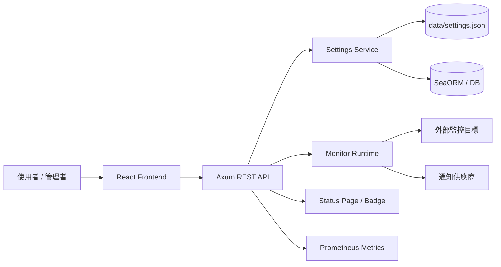
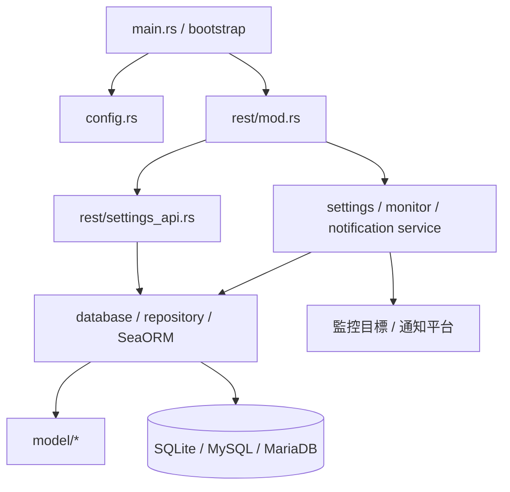
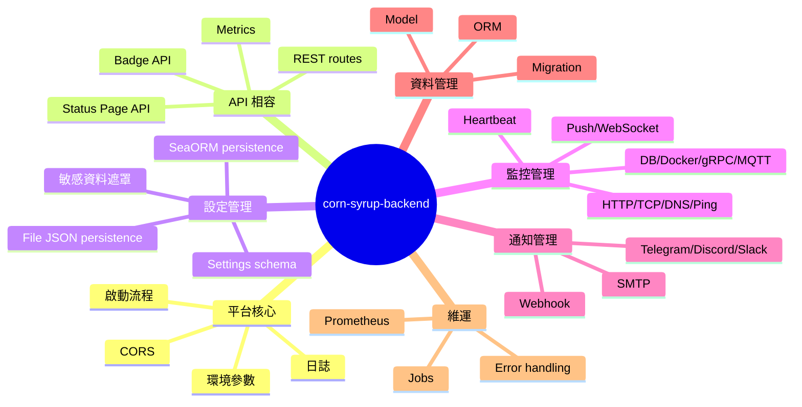
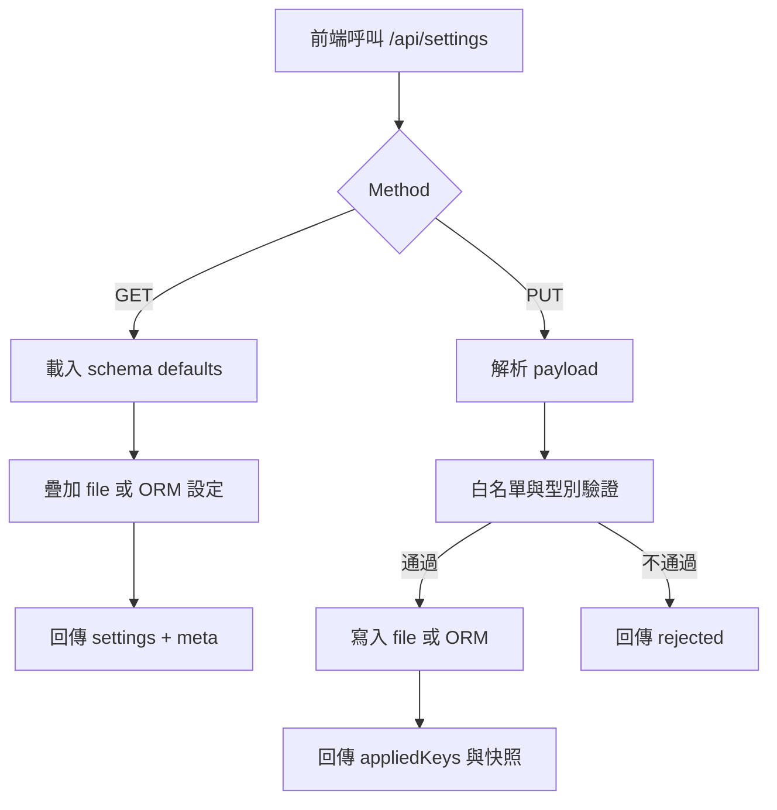
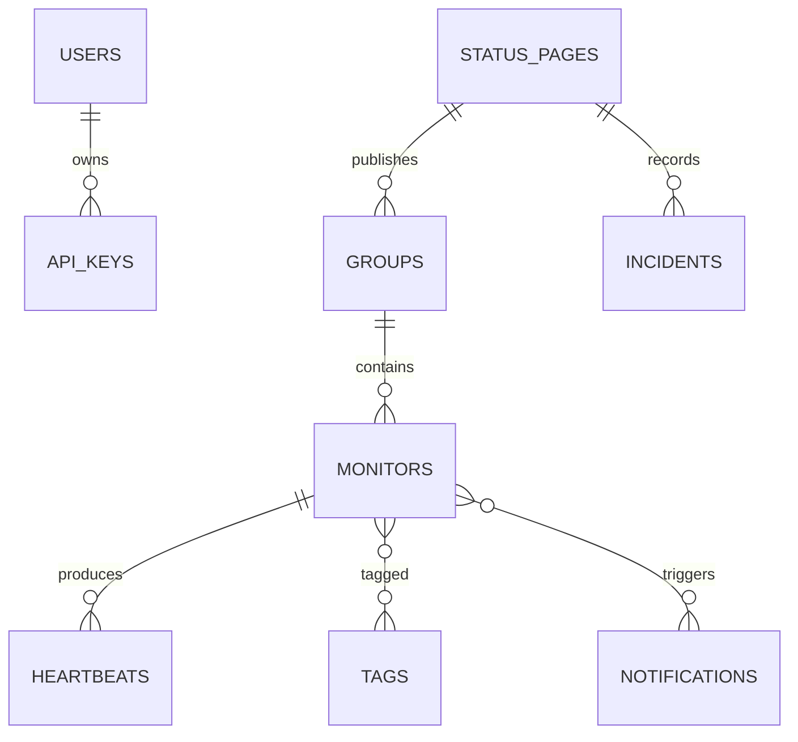
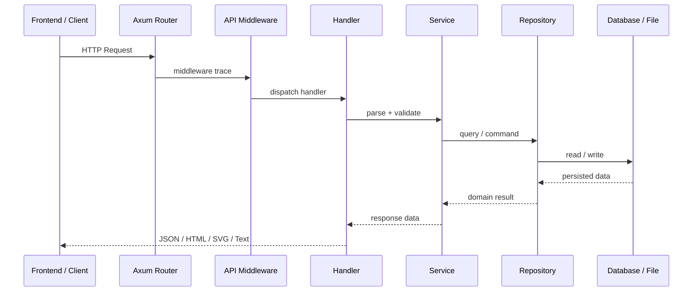
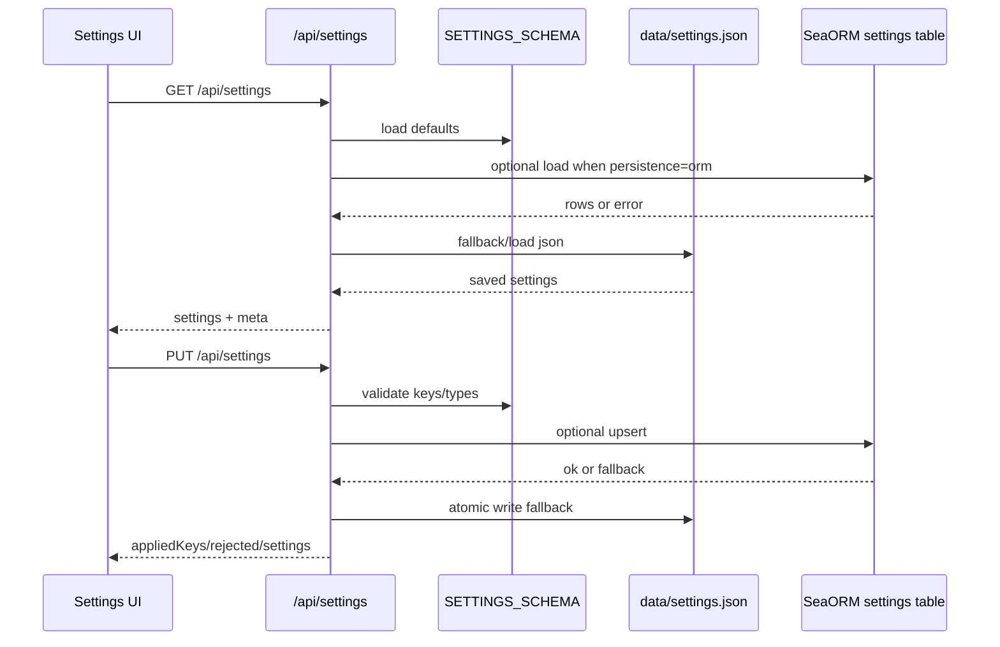

# corn-syrup-backend 軟體設計規格書（SDD）

## 封面

| 項目 | 內容 |
|------|------|
| 業主 / 單位 | 內部開發與維運團隊 |
| 專案名稱 | corn-syrup |
| 系統名稱 | corn-syrup-backend |
| 文件名稱 | 軟體設計規格書 |
| 文件編碼 | CORN-SYRUP-BACKEND-SDD |
| 文件版本 | V1 |
| 內部版本 | 01.00 |
| 撰寫單位 | AI 協作工程團隊 |
| 撰寫日期 | 2026/05/04 |
| 作者 | Roo |

## 文件資訊

| 項目 | 內容 |
|------|------|
| 文件目的 | 說明 corn-syrup-backend 後端軟體設計，作為後續開發、測試、驗收、維運與相容性比對依據。 |
| 適用範圍 | 涵蓋 Rust 後端啟動、設定、REST API、資料庫、監控、通知、狀態頁、設定管理、日誌、安全與非功能需求設計。 |
| 相關文件 | 需求文件、規格文件、計畫文件、工作項目、API 實作檢查表、源碼轉譯檢查表與 SDD 範本。 |
| 名詞定義 | Uptime Kuma：參考系統；Monitor：監控項目；Heartbeat：心跳紀錄；Settings：系統設定；Status Page：公開狀態頁。 |

## 章節目錄

- [1. 概說](#1-概說)
- [2. 系統概述](#2-系統概述)
- [3. 系統設計](#3-系統設計)
- [4. 非功能需求設計](#4-非功能需求設計)
- [5. 修訂記錄](#5-修訂記錄)
- [附錄 A：AI 產出檢查清單](#附錄-aai-產出檢查清單)

## 圖目錄

| 圖號 | 圖名 | 章節 | 備註 |
|------|------|------|------|
| 圖2-1 | 系統架構圖 | 2.1 | 後端與前端、資料庫、外部監控目標互動 |
| 圖3-1 | 模組設計架構圖 | 3.1 | Rust 後端模組分層 |
| 圖3-2 | 功能架構圖 | 3.2 | 後端功能模組 mindmap |
| 圖3-3 | REST API 請求流程 | 3.5 | API request/response 流程 |
| 圖3-4 | Settings API 資料流 | 3.5 | Settings load/update persistence 流程 |

## 表目錄

| 表號 | 表名 | 章節 | 備註 |
|------|------|------|------|
| 表2-1 | 系統環境架構 | 2.2 | 開發、測試、正式與安全配置 |
| 表2-2 | 系統功能模組概述 | 2.3 | 後端主要模組 |
| 表3-1 | 系統功能架構說明 | 3.2 | 功能編號與說明 |
| 表3-2 | REST API 功能規格 | 3.3 | 已實作與相容性 API |
| 表3-3 | Settings API 功能規格 | 3.3 | 設定查詢、更新與驗證 |
| 表3-4 | 資料表設計 | 3.4 | 主要資料模型 |
| 表3-5 | 錯誤碼設計說明 | 3.6 | API 錯誤分類 |
| 表4-1 | 角色與功能模組權限對照表 | 4.1 | 權限需求 |

---

# 1. 概說

本章說明 corn-syrup-backend 軟體設計規格書的識別資訊、專案範圍、文件依據與參考資料。corn-syrup-backend 是以 Rust 重新實作 Uptime Kuma 後端行為的服務，目標是在保留既有 API、監控、通知、狀態頁與設定流程相容性的前提下，逐步建立可維護、可測試且可部署的後端架構。

本文件以現有程式碼、後端需求規格、後端設計規格、工作計畫、工作項目、REST API 實作檢查表與參考系統行為為依據，描述後端模組的責任邊界與資料流。文件內容偏向工程設計與開發驗收，若部分外部環境、權限矩陣或完整 migration 尚未定案，將以「待補」或明確限制方式標示。

## 1.1 識別

本文件為 corn-syrup 專案後端服務 corn-syrup-backend 的軟體設計規格書，依據目前 Rust 後端實作狀態與後端規格文件產生。文件用於支援後續功能補強、API 相容性檢核、資料庫模型設計、非功能需求驗證與維運交接，並作為開發團隊追蹤實作差異的基準。

corn-syrup-backend 的識別重點在於「Uptime Kuma 相容後端」與「Rust 服務化重構」兩項設計主軸。系統不只是單純複製 Node.js/Express 程式，而是以 Rust、Axum、Tokio、SeaORM 與結構化模組重新表達相同行為，同時保留前端呼叫路由、公開狀態頁、metrics 與 settings 合約。

| 項目 | 內容 |
|------|------|
| 專案編號 | CORN-SYRUP |
| 系統編號 | CORN-SYRUP-BACKEND |
| 系統名稱 | corn-syrup-backend |
| 文件代碼 | CORN-SYRUP-BACKEND-SDD |
| 文件版本 | V1 |

## 1.2 專案名稱

本專案名稱為 corn-syrup，後端系統名稱為 corn-syrup-backend。專案定位為 Uptime Kuma 的 Rust 後端與 React/TypeScript 前端再實作版本，其中後端負責服務啟動、設定載入、REST API、資料持久化、監控執行、通知建構、狀態頁資料供應、metrics 與安全控制。

本文件僅聚焦後端設計，不直接描述 React 前端細部元件設計，但會記錄前端依賴的 API 合約、settings 分群與 i18n 基準。前端與後端需共同維持繁體中文、英文、日文至少三語支援，且預設語系為繁體中文，避免後端回應與 UI 呈現出現語意落差。

## 1.3 範圍

本文件涵蓋 corn-syrup-backend 的後端設計範圍，包括啟動流程、環境參數、REST framework、API route table、settings API、資料庫 ORM、監控模型、通知模型、狀態頁、維護模式、Prometheus metrics、錯誤處理、日誌、安全與效能需求。設計重點是說明目前已落地與規劃中的模組如何形成可演進的服務架構。

本文件不包含完整前端畫面細節、外部通知平台實際憑證申請流程、正式環境網路拓樸採購、容器平台營運手冊，以及所有監控協定的低階封包格式。若後續實作需要擴充監控類型、通知供應商或資料庫 migration，應另行更新規格、任務文件與本 SDD。

本系統設計範圍包含：

- 後端啟動、設定與環境參數載入。
- REST API、狀態頁 API、badge API、metrics API 與 settings API。
- SQLite/MySQL/MariaDB 連線設定與 SeaORM 資料模型。
- HTTP、TCP、DNS、Ping、Push、WebSocket、資料庫、Docker、gRPC、MQTT 等監控模組設計。
- SMTP、Telegram、Discord、Slack、Webhook 等通知供應商模型。
- 日誌、錯誤、安全、效能與維運需求。

本文件不包含：

- React 前端每個元件的 UI 版面細節。
- 正式機房防火牆設備規格與雲端資源採購規格。
- 尚未確認的第三方服務商商務合約與 SLA。

## 1.4 依據

本 SDD 以現有後端規格與實作檔案為主要依據，並參考 Uptime Kuma server 目錄作為行為來源。後端需求文件描述監控、通知、認證、狀態頁與資料儲存等階段性需求；後端規格文件補充 REST API、Settings API、ORM 與安全驗證；工作計畫與任務文件則提供實作順序。

目前 API 實作檢查表顯示 REST framework 與多個 API endpoint 已完成 Axum route 對應，Settings API 亦已由 placeholder 演進為 schema、file JSON persistence 與可選 SeaORM persistence。此文件會以已完成項目為基準，同時保留未完成功能的設計方向，避免文件只反映理想規劃而忽略實際落地狀態。

| 類別 | 文件 / 來源 | 說明 |
|------|-------------|------|
| SDD 範本 | 20.doc/48.spec/backend/89.sdd-template.md | 本文件章節與表格格式依據 |
| 需求文件 | 20.doc/48.spec/backend/01.Requirements/Requirements.md | 後端功能需求來源 |
| 規格文件 | 20.doc/48.spec/backend/02.Spec/Spec.md | 後端功能與 API 規格來源 |
| 計畫文件 | 20.doc/48.spec/backend/03.Plan/Plan.md | 階段工作計畫來源 |
| 任務文件 | 20.doc/48.spec/backend/05.Task/Task.md | 實作工作項目來源 |
| 檢查表 | 20.doc/48.spec/80.checklist/80.translate_check-list.md | REST API 實作檢核來源 |
| 參考系統 | /home/ccbruce/public/github/uptime-kuma/server | Uptime Kuma server 行為參考 |

## 1.5 相關之其它計畫書

本系統相關計畫書包括後端需求文件、後端規格文件、後端計畫文件、後端任務文件、API 實作檢查表、源碼轉譯檢查表、ChangeLog 與每次工作 Resume。這些文件共同形成從需求、設計、實作、驗證到歷史追蹤的鏈結，利於後續審查與維運。

後續若需要補齊正式測試計畫、維運計畫、安全稽核計畫與部署計畫，建議延續相同目錄結構新增文件，並在本章補充引用。所有計畫文件應維持繁體中文撰寫，必要時附上英文技術詞彙，避免團隊在 API 名稱、模組命名與使用者顯示文字之間產生不一致。

- 後端需求規格書。
- 後端系統規格書。
- 後端工作計畫書。
- 後端工作項目清單。
- REST API 實作檢查表。
- 源碼轉譯檢查表。
- 測試計畫書（待補）。
- 維運計畫書（待補）。

## 1.6 參考資料

本文件參考資料以專案內部文件與現有程式碼為主，並以 Uptime Kuma server 作為行為比對來源。Rust 後端目前使用 Axum 作為 REST framework、Tokio 作為 async runtime、SeaORM 作為 ORM framework，並透過 env_logger/log 進行日誌輸出，這些技術選型均會影響模組責任與錯誤處理策略。

參考資料中的資料庫連線資訊僅作為環境設計依據，文件內不揭露明文密碼。若需於測試或正式環境套用資料庫設定，應使用 .env 或部署平台 secret 管理能力，並確認日誌遮罩、檔案權限與備份政策均符合資安要求。

| 文件名稱 | 文件編號 / 版本 | 說明 |
|----------|------------------|------|
| Uptime Kuma server | upstream reference | Node.js/Express 參考後端 |
| corn-syrup-backend Cargo.toml | 0.1.0 | Rust crate、binary 與依賴設定 |
| ChangeLog.md | 持續更新 | 專案異動歷程 |
| env.sample | 持續更新 | 環境參數範例 |
| .env | 本機設定 | 實際環境參數，密碼不得寫入文件明文 |

---

# 2. 系統概述

corn-syrup-backend 是一個以 Rust 實作的後端服務，透過 Axum 對外提供 HTTP API，並以模組化方式承載設定、資料庫、監控、通知、狀態頁、metrics、proxy、Docker、remote browser 與工具函式。系統啟動時會載入 .env 與命令列參數，建立資料目錄、資料庫設定、Settings cache、JWT secret 與 middleware。

系統整體定位是支援 Uptime Kuma 相容的監控服務，前端可透過 REST API 取得監控清單、狀態頁資料、badge、settings 與 metrics。資料持久化目前包含 SQLite data dir、file JSON settings 與可選 SeaORM settings persistence；後續監控、通知與使用者資料可依同一 ORM 模式擴充。

## 2.1 系統架構設計

系統架構採前後端分離設計。React/TypeScript 前端負責畫面、路由、使用者互動與 i18n 呈現；Rust 後端提供 API、狀態頁入口、資料查詢與系統設定。後端透過 REST route table 對齊 Uptime Kuma 既有 endpoint，並預留 Socket.IO/WebSocket、jobs 與監控 runtime 的演進空間。

資料庫層目前支援 SQLite 路徑初始化與 SeaORM 設定建構，並可依 DATABASE_TYPE、DATABASE_URL 或 host/user/password 組出資料庫連線。外部系統包含被監控 HTTP/TCP/DNS 目標、通知服務、Docker daemon、Remote Browser、Prometheus scraper 與可能的資料庫監控目標。



| 元件 | 說明 | 技術 / 協定 | 備註 |
|------|------|-------------|------|
| 前端 | 管理介面、狀態頁、設定頁、監控儀表板 | React、TypeScript、Vite | 非本文件細部範圍 |
| 後端 | API、設定、監控、通知、資料持久化 | Rust、Axum、Tokio | 本文件主範圍 |
| 資料庫 | 設定、監控、心跳、使用者與狀態資料 | SQLite、MySQL/MariaDB、SeaORM | 依環境設定切換 |
| 外部系統 | 被監控服務與通知平台 | HTTP、TCP、DNS、SMTP、Webhook | 依監控/通知模組擴充 |

## 2.2 系統環境架構設計

開發環境以 Linux、Rust toolchain、Cargo、Makefile 與本機 .env 為基礎，後端工作目錄為 src/backend。服務預設可由 CORN_SYRUP_BACKEND_HOST 與 CORN_SYRUP_BACKEND_PORT 決定 listen 位址，CORS 可由 CORN_SYRUP_BACKEND_CORS_ORIGIN 設定，以支援前端開發環境跨來源呼叫。

測試與正式環境應以相同 .env schema 管理資料庫、host、port、SSL、CORS、settings persistence 與資料目錄。正式環境建議啟用 HTTPS/TLS，使用 secret manager 管理資料庫密碼、JWT secret、API key 與通知 token，並確保資料庫帳號採最小權限原則。

| 環境 | 說明 |
|------|------|
| 開發環境 | Linux、Rust 2021 edition、Cargo、src/backend Makefile、本機 .env。 |
| 測試環境 | 使用測試資料庫或 SQLite data dir，執行 make check、make test 與 API 相容性測試。 |
| 正式環境 | 建議以 systemd、容器或編排平台執行 corn-syrup-backend，設定 TLS、備份與集中日誌。 |
| 備援架構 | 待正式部署規格決定，可採 DB 備份、服務重啟與水平擴充策略。 |
| 網路安全 | CORS 白名單、HTTPS、資料庫來源限制、反向代理 trusted proxies。 |
| 日誌與監控 | env_logger/log debug、INFO/WARN/ERROR 分級、Prometheus /metrics。 |

## 2.3 系統功能模組概述

後端功能模組依職責拆分為 config、database、rest、settings、model、monitor、notification、auth、socket、jobs、metrics、proxy、docker、remote 與 error 等目錄。此拆分讓 API handler 不直接承載所有商業邏輯，未來可逐步將 placeholder route 替換為 service/repository 實作。

目前 REST API 已提供首頁、setup database、測試 webhook、robots、metrics、entry-page、badge、monitor placeholder、status page、settings、login/register/logout 等 route。Settings API 是目前較完整的實作，具 schema default、白名單驗證、敏感欄位遮罩、file persistence 與可選 SeaORM persistence。

| 模組 | 功能概述 | 功能編號 | 使用角色 |
|------|----------|----------|----------|
| Config / Bootstrap | 載入 .env、參數、host/port、SSL、data dir | F-BOOT | 系統管理者 |
| REST API | 對外提供 Axum route table、CORS、middleware | F-API | 前端、整合系統 |
| Settings | 設定查詢、更新、驗證與 persistence | F-SET | 系統管理者 |
| Database / ORM | data dir、SQLite runtime、SeaORM config | F-DB | 系統、維運 |
| Monitor | HTTP/TCP/DNS/Ping/Push/WebSocket 等監控 | F-MON | 管理者、操作者 |
| Notification | Email、Webhook、Telegram、Discord、Slack 等通知 | F-NOTIFY | 管理者 |
| Status Page / Badge | 公開狀態頁、RSS、manifest、badge | F-STATUS | 訪客、前端 |
| Metrics / Jobs | Prometheus 指標、清理與 vacuum job | F-OPS | 維運人員 |

### 2.3.1 Config / Bootstrap 模組

Config / Bootstrap 模組負責將命令列參數、.env 與預設值合併為 AppConfig，並在 main_run 期間完成資料目錄、SQLite runtime、SeaORM 設定、settings cache、JWT secret 與 middleware header 初始化。此模組是服務能否穩定啟動的第一層控制點。

模組設計需保留與 Uptime Kuma config.js 相近的語意，例如 host、port、SSL key/cert、demo mode、data dir、websocket URL 與 frame options。環境參數若未提供，需有可預期的預設值；若涉及密碼或 token，日誌與文件皆需遮罩處理。

### 2.3.2 REST API 模組

REST API 模組使用 Axum 建立 route table，對齊 Uptime Kuma 參考系統中的 server、api-router、status-page-router、setup-database 與 simple migration routes。API middleware 會記錄 request start、headers、handler dispatch、response status、headers 與 request end，敏感 header 會遮罩。

目前多個 endpoint 已具備可呼叫回應，但部分監控、認證與狀態頁資料仍為 placeholder。設計上 handler 應逐步轉為 request parse、service 呼叫、response 組裝三段式結構，避免所有驗證與持久化邏輯集中在 route 檔案中。

### 2.3.3 Settings 模組

Settings 模組負責前端設定頁面所需的 settings 載入與更新，支援 General、Appearance、Notifications、Reverse Proxy、Tags、Monitor History、Docker Hosts、Remote Browsers、Security、API Keys、Proxies 與 About 等邏輯分群。About 為唯讀資訊，不直接寫入 settings。

Settings API 使用白名單 schema 驗證 key、型別、允許值與 secret 屬性，更新時回傳 appliedKeys、rejected 與更新後快照。資料可寫入 ./data/settings.json，也可透過 CORN_SYRUP_SETTINGS_PERSISTENCE=orm 使用 SeaORM；ORM 失敗時會 fallback 至 file JSON。

### 2.3.4 Monitor / Notification 模組

Monitor 模組承擔核心監控邏輯，對應 HTTP/HTTPS、TCP、DNS、Ping、Push、WebSocket、資料庫、訊息隊列、Docker、遊戲伺服器、gRPC、SNMP、SIP、Real Browser 等監控類型。各監控型別應產出一致的狀態、回應時間、錯誤訊息與 heartbeat 資料。

Notification 模組負責根據監控狀態變更組裝通知 payload，並支援 SMTP、Telegram、Discord、Slack、Gotify、Pushover、自定義 Webhook 與多種進階供應商。通知設計需確保機敏 token 不寫入明文 log，並能依狀態變更、離線與恢復上線等條件觸發。

---

# 3. 系統設計

本章描述 corn-syrup-backend 的模組分層、功能架構、細部功能、資料庫設計、資料流與錯誤處理。設計原則是以 Uptime Kuma 既有行為為相容目標，同時在 Rust 中採取清楚的型別、模組與責任分離，讓後續實作可逐步由 placeholder 過渡到完整 service/repository。

後端目前已具備可編譯的 crate、binary target、Axum route table、settings API、SeaORM entity 與大量監控/通知模組檔案。系統設計需同時反映「已完成 API 骨架」與「待補強商業邏輯」兩種狀態，因此本章會在表格中標示目前功能責任，而非宣稱所有功能都已完整實作。

## 3.1 模組設計

後端模組分層以 main/bootstrap 為入口，往下依序為 config、rest、service/domain、repository/ORM、model 與外部整合模組。REST handler 不應直接持有大量業務規則，應將設定、監控、通知、狀態頁與資料庫操作抽離為專責模組，以降低檔案行數與測試複雜度。

依使用者要求，單一程式碼檔約 500 行時應依功能切分，必要時建立具語意的子目錄，命名不得使用 part+no。現有 settings_api.rs 已接近較大型檔案，後續建議切分為 settings/schema.rs、settings/service.rs、settings/repository.rs 與 settings/rest.rs。



| 模組 | 子模組 | 職責 | 輸入 | 輸出 |
|------|--------|------|------|------|
| Bootstrap | main_run | 載入設定、初始化資料與啟動步驟 | args、env | BootstrapResult |
| Config | load_config | 合併 .env 與參數，建立 AppConfig | env、args | AppConfig |
| REST | app_with_config | 建立 route table、CORS、middleware | AppConfig | Axum Router |
| Settings | api_settings、api_settings_update | 查詢與更新設定 | JSON request | JSON response |
| Database | orm、setup、embedded | 資料庫路徑、連線與 migration plan | env、data dir | ORM config、runtime |
| Model | setting、monitor、heartbeat 等 | 定義 domain/entity 資料結構 | DB row、payload | struct/entity |
| Monitor | monitor/* | 執行監控並產生 heartbeat | monitor config | status、ping、error |
| Notification | notification/* | 組裝與送出通知 | event、provider config | request plan/result |

## 3.2 功能架構圖

功能架構分為平台核心、API 相容、監控管理、通知管理、狀態頁、設定管理、資料管理與維運監控八大區塊。平台核心提供服務啟動與環境控制；API 相容確保前端與外部使用者可沿用既有路徑；監控與通知模組則承擔產品主要價值。

Settings API 是目前可作為設計樣板的模組，具備 schema、validator、persistence、log masking 與 response meta。後續 monitor CRUD、auth、status page 與 notification API 可參考此模式補齊：先定義 request/response 合約，再加入白名單驗證、repository 與錯誤碼。



### 表3-1：系統功能架構說明

| 功能項目 | 功能說明 | 功能編號 | 備註 |
|----------|----------|----------|------|
| 啟動與設定 | 載入 .env、args、host、port、SSL、data dir | F-BOOT | 已有 main_run 與 AppConfig |
| REST API | 建立 Axum route table 與 middleware | F-API | 已對齊多個 Uptime Kuma route |
| Settings API | 查詢、更新、驗證與持久化 settings | F-SET | 已具 file/ORM persistence |
| 監控模組 | 多協定監控型別與 heartbeat | F-MON | 模組檔案已存在，需逐步驗證行為 |
| 通知模組 | 多通知供應商 payload 與送出流程 | F-NOTIFY | 模組檔案已存在，需補齊端對端測試 |
| 狀態頁 | 公開狀態頁、RSS、manifest、incident history | F-STATUS | route 已存在，資料邏輯待擴充 |
| Metrics | Prometheus /metrics | F-METRIC | 目前回傳基本 up gauge |
| 資料庫 | SQLite runtime、SeaORM config、settings entity | F-DB | ORM 設定已落地 |

## 3.3 細部功能規格

細部功能規格依目前後端優先順序描述 API framework、Settings API、資料庫/ORM、監控與通知。每項功能需說明業務目的、操作流程、欄位、檢核、API 合約、後端處理與日誌設計。若目前仍為 placeholder，需在說明中明確指出待後續 service/repository 補齊。

本系統後端多數功能無直接 UI，但由 React 前端或外部 HTTP client 呼叫，因此「功能 UI」欄位以「無後端 UI，由前端頁面或 API client 操作」表示。API response 應維持 JSON 或 SVG badge 等既有格式，並以 content-type 明確回應。

### 3.3.1 REST API Framework（F-API）

#### 3.3.1.1 功能說明

REST API Framework 以 Axum 建立 HTTP route table，提供首頁、setup database、測試 webhook、robots.txt、metrics、entry-page、badge、monitor、status page、settings、auth 與 migrate-status 等 endpoint。設計目的為對齊 Uptime Kuma Express route，讓前端可逐步切換至 Rust 後端。

API framework 同時提供 CORS 與 API debug middleware。middleware 僅對 /api 路徑輸出 request/response trace，並遮罩 authorization、cookie、set-cookie、x-api-key、x-auth-token 等敏感 header，避免 debug log 外洩憑證。

#### 3.3.1.2 功能 UI

| 項目 | 說明 |
|------|------|
| UI 圖號 | 無後端 UI |
| UI 名稱 | REST API 由前端或外部 client 呼叫 |
| 操作流程 | 前端發送 HTTP request，後端 route handler 回傳 JSON、HTML、Text 或 SVG |
| RWD / 行動裝置 | 由前端負責 |

#### 3.3.1.3 API 設計

| API 名稱 | Method | URL | 回應 | 狀態 |
|----------|--------|-----|------|------|
| 前端入口 | GET | / | HTML | 已實作 |
| 資料庫設定資訊 | GET | /setup-database-info | JSON | 已實作 |
| 設定資料庫 | POST | /setup-database | JSON | 已實作 |
| 測試 webhook | POST | /test-webhook | JSON | 已實作 |
| robots | GET | /robots.txt | text/plain | 已實作 |
| metrics | GET | /metrics | text/plain | 已實作基本指標 |
| entry page | GET | /api/entry-page | JSON | 已實作 |
| settings | GET/PUT | /api/settings | JSON | 已實作 |
| 狀態頁 | GET | /status/:slug | HTML | 已實作入口 |
| 狀態頁資料 | GET | /api/status-page/:slug | JSON | placeholder |

#### 3.3.1.4 後端處理邏輯

| 步驟 | 說明 | 主要模組 / 函式 | 備註 |
|------|------|------------------|------|
| 1 | 建立 Router | rest::app_with_config | 註冊 route table |
| 2 | 套用 middleware | api_debug_middleware | 記錄 API trace |
| 3 | 套用 CORS | cors_layer | 依 config/env 設定來源 |
| 4 | 呼叫 handler | 各 API handler | 回傳 JSON/Text/HTML/SVG |
| 5 | 回傳 response | IntoResponse | 設定 content-type |

#### 3.3.1.5 日誌設計

| 時機 | Log Level | 記錄內容 | 敏感資料處理 |
|------|-----------|----------|--------------|
| API 開始 | DEBUG | method、uri、version | 不記錄 body secret |
| Header | DEBUG | header key/value | auth/cookie/API key 遮罩 |
| Handler | DEBUG | step 與摘要 | 不輸出密碼/token |
| API 結束 | DEBUG | status、elapsed_ms | response secret 遮罩 |

### 3.3.2 Settings API（F-SET）

#### 3.3.2.1 功能說明

Settings API 提供前端 settings 頁籤初始化與儲存能力，支援以 GET /api/settings 載入完整設定快照，以 PUT /api/settings 批次更新變更欄位。此功能以 schema 定義 key、group、型別、預設值、是否敏感與允許值，避免未知 key 或錯誤型別污染設定資料。

Settings API 的 persistence 預設為 file JSON，寫入 ./data/settings.json，並支援 CORN_SYRUP_SETTINGS_FILE 覆蓋路徑。若 CORN_SYRUP_SETTINGS_PERSISTENCE 設為 orm 或 sea-orm，會透過 SeaORM 連線 settings table；若 ORM 失敗，系統會 log 並 fallback 至 file JSON。

#### 3.3.2.2 功能 UI

| 項目 | 說明 |
|------|------|
| UI 圖號 | 無後端 UI |
| UI 名稱 | 前端 Settings 頁籤 |
| 操作流程 | 前端載入 settings，使用者調整欄位，前端送出 PUT /api/settings |
| RWD / 行動裝置 | 由前端 settings 頁面負責 |

#### 3.3.2.3 欄位規格

| 欄位名稱 | 欄位類型 | 欄位屬性 | 對應資料庫欄位 | 說明 |
|----------|----------|----------|----------------|------|
| timezone | String | Required | settings.key/value_json | 時區設定 |
| language | String | Required | settings.key/value_json | 語系設定，支援繁中/英文/日文 |
| theme | String | Required | settings.key/value_json | Auto/Light/Dark |
| keepMonitorHistory | Number | Required | settings.key/value_json | 監控歷史保留天數 |
| dataRetentionEnabled | Boolean | Required | settings.key/value_json | 是否啟用資料保留 |
| steamApiKey | String | Secret | settings.key/value_json | Steam API key，log 遮罩 |
| globalpingApiToken | String | Secret | settings.key/value_json | Globalping token，log 遮罩 |
| proxyPassword | String | Secret | settings.key/value_json | Proxy 密碼，log 遮罩 |

#### 3.3.2.4 欄位檢核

| 欄位名稱 | 檢核方式 | 提示文字 | 錯誤碼 |
|----------|----------|----------|--------|
| key | 白名單 | unknown setting key | EV01 |
| number 欄位 | 整數轉換 | expected integer number | EV02 |
| boolean 欄位 | true/false/1/0 | expected boolean | EV03 |
| enum 欄位 | allowed_values | invalid value | EV04 |
| secret 欄位 | log masking | 不可輸出明文 | EV05 |

#### 3.3.2.5 功能流程



#### 3.3.2.6 API 設計

| 項目 | 內容 |
|------|------|
| API 名稱 | 查詢 settings |
| Method | GET |
| URL | /api/settings |
| 權限 | 待補：管理者登入後可用；目前 route 未完成 auth guard |
| Response Content-Type | application/json |

##### Response - 成功

```json
{
  "ok": true,
  "settings": {
    "language": "繁體中文",
    "theme": "Auto"
  },
  "meta": {
    "version": 1,
    "source": "file-overlay-schema",
    "persistence": "file-json"
  }
}
```

| 項目 | 內容 |
|------|------|
| API 名稱 | 更新 settings |
| Method | PUT |
| URL | /api/settings |
| 權限 | 待補：管理者登入後可用；目前 route 未完成 auth guard |
| Request Content-Type | application/json |
| Response Content-Type | application/json |

##### Request

```json
{
  "section": "appearance",
  "settings": {
    "language": "繁體中文",
    "theme": "Dark"
  }
}
```

##### Response - 成功

```json
{
  "ok": true,
  "appliedKeys": ["language", "theme"],
  "rejected": [],
  "settings": {
    "language": "繁體中文",
    "theme": "Dark"
  }
}
```

##### Response - 失敗

```json
{
  "ok": false,
  "appliedKeys": [],
  "rejected": [
    { "key": "unknown", "reason": "unknown setting key" }
  ],
  "settings": {}
}
```

#### 3.3.2.7 後端處理邏輯

| 步驟 | 說明 | 主要模組 / 函式 | 備註 |
|------|------|------------------|------|
| 1 | 解析 request | SettingsUpdateRequest | 支援 settings 包裝與 direct payload |
| 2 | 載入 schema | SETTINGS_SCHEMA | 定義 key、group、kind、default、secret |
| 3 | 驗證欄位 | validate_setting_value | 白名單、型別、allowed values |
| 4 | 載入現有設定 | load_settings_snapshot | defaults 疊加 file/ORM |
| 5 | 儲存設定 | save_settings_snapshot | ORM 優先或 file JSON |
| 6 | 回傳結果 | api_json_value | JSON response 與敏感值遮罩 log |

### 3.3.3 監控與通知功能（F-MON / F-NOTIFY）

#### 3.3.3.1 功能說明

監控功能支援多種監控類型，包含 HTTP/HTTPS、TCP、DNS、Ping、Push、WebSocket、資料庫、RabbitMQ、MQTT、Docker、遊戲伺服器、gRPC、SNMP、SIP 與 Real Browser 等。每個監控項目應依設定週期執行，產生狀態、回應時間、錯誤原因與 heartbeat 歷史。

通知功能根據監控狀態變更觸發，支援離線通知、恢復上線通知與指定供應商 payload。通知模組需統一敏感資料遮罩與失敗處理，避免 provider token、webhook URL、SMTP 密碼或 API key 進入 log。

#### 3.3.3.2 功能 UI

| 項目 | 說明 |
|------|------|
| UI 圖號 | 無後端 UI |
| UI 名稱 | 前端監控編輯、儀表板與通知設定頁 |
| 操作流程 | 前端建立監控與通知，後端排程執行並依狀態觸發通知 |
| RWD / 行動裝置 | 由前端負責 |

#### 3.3.3.3 後端處理邏輯

| 步驟 | 說明 | 主要模組 / 函式 | 備註 |
|------|------|------------------|------|
| 1 | 載入監控設定 | model::monitor / repository | 待補完整 CRUD |
| 2 | 執行監控 | monitor/* | 依 type 呼叫不同 monitor |
| 3 | 產生 heartbeat | model::heartbeat | 記錄 status、ping、message |
| 4 | 判斷狀態變更 | monitor/group/evaluator | 待補完整規則 |
| 5 | 組裝通知 | notification/* | 依 provider 產生 payload |
| 6 | 寫入歷史 | database/ORM | 待補 migration 與 repository |

### 3.3.4 狀態頁與 Badge 功能（F-STATUS）

#### 3.3.4.1 功能說明

狀態頁功能提供公開頁面入口、RSS、manifest、incident history、heartbeat 與 badge API，讓外部使用者不登入也能查看服務可用狀態。後端需依 slug 載入狀態頁設定、群組、監控項目與 incident 資料，並以符合前端需求的 JSON 或 SVG 回應。

目前 route table 已包含 /status、/status-page、/status/:slug 與多個 /api/status-page/* endpoint，部分資料回應仍為 placeholder。後續應補齊 status_page、incident、heartbeat、group 與 monitor repository，使公開狀態頁資料與監控結果一致。

#### 3.3.4.2 API 設計

| API 名稱 | Method | URL | 回應 | 備註 |
|----------|--------|-----|------|------|
| 狀態頁入口 | GET | /status/:slug | HTML | 前端掛載點 |
| 狀態頁 RSS | GET | /status/:slug/rss | XML | RSS feed |
| 狀態頁資料 | GET | /api/status-page/:slug | JSON | 待補 repository |
| 心跳資料 | GET | /api/status-page/heartbeat/:slug | JSON | 待補 repository |
| manifest | GET | /api/status-page/:slug/manifest.json | JSON | 已回傳基本 name |
| incident history | GET | /api/status-page/:slug/incident-history | JSON | 待補 repository |
| status badge | GET | /api/status-page/:slug/badge | SVG | 已回傳 badge placeholder |

## 3.4 資料庫設計

資料庫設計需支援 Uptime Kuma 既有資料模型概念，包含 user、monitor、heartbeat、group、tag、notification、maintenance、status_page、incident、proxy、docker_host、remote_browser 與 settings。Rust 後端目前已建立多個 model 檔案，settings model 已具 SeaORM Entity。

目前可運作的 settings persistence 包含 file JSON 與可選 SeaORM。後續建議建立正式 migration 層，將 raw DDL 移出 API handler，並針對 SQLite 與 MySQL/MariaDB 差異建立一致的 schema 管理策略。資料庫密碼與連線字串必須遮罩記錄。

### 3.4.1 Settings 資料表（settings）

| 欄位名稱 | 資料類型 | 允許 Null | Key | 預設值 | 說明 |
|----------|----------|-----------|-----|--------|------|
| id | INTEGER | NO | PK | AUTOINCREMENT | 設定資料主鍵 |
| key | TEXT / VARCHAR | NO | UK | - | 設定鍵名 |
| value_json | TEXT / JSON | NO | - | - | 設定值，以字串或 JSON 表示 |
| value_type | TEXT / VARCHAR | NO | - | - | string、number、boolean、json、null |
| group_name | TEXT / VARCHAR | NO | - | - | 設定分群 |
| is_secret | BOOLEAN / INTEGER | NO | - | false | 是否為敏感值 |
| created_at | TEXT / DATETIME | NO | - | CURRENT_TIMESTAMP | 建立時間 |
| updated_at | TEXT / DATETIME | NO | - | CURRENT_TIMESTAMP | 更新時間 |

#### Index / Constraint

| 名稱 | 類型 | 欄位 | 說明 |
|------|------|------|------|
| pk_settings | PK | id | 主鍵 |
| uk_settings_key | UK | key | 每個設定 key 僅允許一筆 |

### 3.4.2 主要資料模型規劃

| 資料表 / Entity | 說明 | 對應模組 | 備註 |
|-----------------|------|----------|------|
| users | 使用者、密碼、2FA、JWT 關聯資料 | model/user.rs | 待補完整 migration |
| monitors | 監控項目設定 | model/monitor.rs | 支援多 monitor type |
| heartbeats | 監控心跳紀錄 | model/heartbeat.rs | 歷史資料與 uptime 計算 |
| groups | 監控群組 | model/group.rs | 狀態頁與儀表板使用 |
| tags | 標籤資料 | model/tag.rs | 監控分類 |
| status_pages | 公開狀態頁 | model/status_page.rs | slug 查詢 |
| incidents | 狀態頁事件 | model/incident.rs | incident history |
| maintenances | 維護排程 | model/maintenance.rs | 維護期間通知控制 |
| api_keys | API Key | model/api_key.rs | 待補權限與雜湊 |
| proxies | Proxy 設定 | model/proxy.rs | 敏感值需遮罩 |
| docker_hosts | Docker 主機 | model/docker_host.rs | Docker API 監控 |
| remote_browsers | Remote Browser 設定 | model/remote_browser.rs | token 需遮罩 |



## 3.5 資料流設計

資料流設計描述前端、API、service、repository、資料庫與外部服務之間的互動。REST API 的基本資料流是 request 進入 Axum route，middleware 記錄 trace，handler 解析輸入，service 驗證與處理，repository 讀寫資料，最後回傳 JSON 或其他內容。

Settings API 的資料流已較完整，可作為後續 API 的參考。GET 流程會先建立 schema default，再疊加 file 或 ORM 已保存資料；PUT 流程會正規化 payload、驗證 key 與型別、套用變更、寫入 persistence，並回傳 appliedKeys、rejected 與 settings 快照。

### 3.5.1 REST API 請求資料流



| 步驟 | 來源 | 目的 | 資料內容 | 備註 |
|------|------|------|----------|------|
| 1 | Frontend | Axum Router | HTTP method、URL、headers、body | CORS 檢查 |
| 2 | Middleware | Log | request trace | 敏感 header 遮罩 |
| 3 | Handler | Service | DTO / request struct | 待逐步 service 化 |
| 4 | Service | Repository | 查詢或異動命令 | 驗證與商業邏輯 |
| 5 | Repository | DB/File | SQL、ORM、JSON file | persistence |
| 6 | Handler | Client | response body | content-type 正確設定 |

### 3.5.2 Settings API 資料流



| 步驟 | 來源 | 目的 | 資料內容 | 備註 |
|------|------|------|----------|------|
| 1 | UI | API | section、settings | 支援 direct payload |
| 2 | API | Schema | key/value | 白名單與型別檢核 |
| 3 | API | ORM | settings upsert | 可選 SeaORM |
| 4 | API | File | settings.json | ORM 失敗 fallback |
| 5 | API | UI | appliedKeys、rejected、meta | secret log 遮罩 |

## 3.6 錯誤處理與例外處理

錯誤處理設計需區分使用者輸入錯誤、驗證錯誤、未授權、無權限、資料不存在、資料衝突、外部依賴錯誤、資料庫錯誤與非預期系統錯誤。API response 應維持穩定 JSON 結構，避免把內部錯誤堆疊或敏感資訊直接回傳給前端。

目前部分 API handler 仍回傳簡化 JSON，尚未全域導入錯誤碼模型。後續建議建立 error/mod.rs 的標準 ApiError、ErrorCode、HTTP status mapping 與 response builder，讓 Settings API、monitor API、auth API 與 status page API 的錯誤處理一致。

### 3.6.1 錯誤捕捉與分類

| 異常類型 | 描述 | 回應處理方式 |
|----------|------|--------------|
| 使用者輸入異常 | 欄位缺漏、型別錯誤、enum 不合法 | 回傳 EVxx 與 rejected 欄位 |
| 未驗證 | 未登入、token 缺失或過期 | 回傳 EA01 / 401 |
| 無權限 | 使用者角色不可操作功能 | 回傳 EA02 / 403 |
| 資料不存在 | 查詢 monitor/status/settings key 不存在 | 回傳 E002 / 404 |
| 資料衝突 | 唯一鍵重複或版本衝突 | 回傳 E001 / 409 |
| 外部依賴錯誤 | 監控目標、通知平台、Docker、DB 連線失敗 | 記錄錯誤並回傳 E998 |
| 系統錯誤 | 未預期 panic、IO、serialization、ORM 錯誤 | 記錄 ERROR，回傳 E999 |

### 3.6.2 錯誤碼設計

| 處理結果 | 代碼 | HTTP Status Code | 處理結果說明 | 原因說明 |
|----------|------|------------------|--------------|----------|
| 成功 | 0000 | 200 | 交易成功 | - |
| 新增成功 | 0000 | 201 | 新增成功 | - |
| 資料已存在 | E001 | 409 | 資料已經存在 | 唯一值重複 |
| 資料不存在 | E002 | 404 | 資料不存在 | 查詢 / 更新 / 刪除資料不存在 |
| 欄位檢核錯誤 | EV01 | 400 | 欄位不得為空或未知 key | 必填或白名單檢核失敗 |
| 欄位型別錯誤 | EV02 | 422 | 欄位型別錯誤 | number/boolean/enum 檢核失敗 |
| 未驗證 | EA01 | 401 | 未進行驗證 | Token / API key 缺失 |
| 無權限 | EA02 | 403 | 無權限操作 | 權限不足 |
| 外部 API 失敗 | E998 | 502 | 外部依賴呼叫失敗 | 監控或通知供應商異常 |
| 系統錯誤 | E999 | 500 | 系統錯誤 / 非預期錯誤 | 未預期例外 |

### 3.6.3 錯誤日誌

錯誤日誌需包含時間戳、request id 或 trace id、method、URL、使用者或 API key 摘要、來源 IP、錯誤分類、錯誤碼、錯誤訊息、模組名稱與處理耗時。若錯誤發生於外部依賴，需記錄供應商名稱、endpoint 摘要與重試結果，但不得記錄完整 token、password 或 webhook secret。

系統 log level 建議依環境調整，開發與測試環境可使用 DEBUG，正式環境預設 INFO，僅於排障時短暫提升。ERROR log 應保留足夠排查資訊，但 response 給使用者時需使用通用訊息，避免洩漏資料庫連線字串、檔案路徑或內部堆疊。

---

# 4. 非功能需求設計

非功能需求涵蓋安全、權限、日誌、效能、介面、可維護性、可觀測性與部署。corn-syrup-backend 因處理監控目標、通知 token、使用者登入、API key 與資料庫連線資訊，必須將機敏資料遮罩、最小權限、HTTPS、備份與稽核納入基本設計。

系統目前以 Rust、Axum 與 Tokio 提供高效能非同步基礎，但實際效能仍取決於監控排程數量、資料庫連線池、HTTP client timeout、通知重試與 heartbeat 保留策略。後續應建立可量測指標與壓力測試，避免僅以編譯成功代表可正式上線。

## 4.1 安全性需求

安全性需求包含使用者身份驗證、角色權限、API key、資料傳輸安全、資料儲存安全、log masking 與反向代理設定。管理類 API 應要求登入與授權，公開狀態頁 API 則需限制只輸出可公開資訊，不可洩漏內部監控密碼、proxy credentials 或通知設定。

系統設定檔 .env 可能包含資料庫 host、database、user 與 password，文件與日誌中密碼一律以 *** 遮罩。正式環境應避免將 .env 納入版本控制，並以檔案權限、secret manager 或部署平台環境變數提供敏感值。

### 4.1.1 使用權限需求

| 角色 | 權限說明 | 可操作模組 |
|------|----------|------------|
| 系統管理者 | 所有系統管理、設定、使用者、API key、監控與通知權限 | 全部管理模組 |
| 應用服務管理者 | 管理監控、通知、狀態頁與維護排程 | Monitor、Notification、Status Page、Maintenance |
| 應用服務操作者 | 查詢儀表板、狀態、歷史與手動操作部分監控 | Dashboard、Status、Heartbeat |
| 公開訪客 | 僅可查看公開狀態頁與 badge | Status Page、Badge |

### 4.1.2 資料安全需求

- 所有管理 API 應進行身份驗證與授權檢查。
- 密碼、Token、API Key、Webhook URL、Proxy Password、Database Password 不得明文記錄於 log。
- 使用者密碼應以安全雜湊保存，不得可逆加密。
- JWT secret 與 API key 應由安全亂數或 secret 管理機制提供。
- 資料庫帳號採最小權限，限制來源網段。
- 遵循 OWASP API Security Top 10 與 OWASP Web Top 10 防護原則。

### 4.1.3 資料傳輸安全

- 正式環境 API 傳輸應使用 HTTPS / TLS 1.2 以上，建議 TLS 1.3。
- 禁止弱加密協定與不安全 Cipher Suite。
- 後端若置於反向代理後，需正確設定 trusted proxies。
- 外部通知與監控目標若支援 TLS，應優先使用加密通道。

### 4.1.4 資料儲存安全

- settings 中 is_secret=true 欄位應於 log 與 UI 回應中依需求遮罩。
- .env、settings.json 與 SQLite database 檔案需設定適當檔案權限。
- 資料庫備份需加密保存並定期驗證還原。
- migration 與資料異動需可追蹤版本與時間。

## 4.2 日誌需求

日誌需支援開發除錯、API trace、錯誤排查、稽核與效能觀測。現有系統使用 env_logger/log，LOG_LEVEL 或 RUST_LOG 可調整等級；REST API middleware 會針對 /api 路徑記錄 request 與 response 摘要，settings API 會記錄 schema、payload、validate、persist 與 response 步驟。

日誌設計的核心限制是敏感資料遮罩。Authorization、Cookie、API Key、Token、Password、Secret、Webhook URL 相關欄位需遮罩或僅記錄摘要。若後續導入集中式日誌，需再次確認 log pipeline 不會保存未遮罩 payload。

| 類型 | 記錄內容 | 保存方式 | 保存期限 |
|------|----------|----------|----------|
| 操作日誌 | 使用者、功能、動作、時間、IP、結果 | 檔案或集中式日誌 | 待補 |
| 系統日誌 | 啟動、停止、設定、排程、migration | stdout / journald / log agent | 待補 |
| 錯誤日誌 | 例外、錯誤碼、模組、堆疊摘要 | 檔案或集中式日誌 | 待補 |
| 稽核日誌 | 權限變更、API key、資料異動 | DB 或集中式日誌 | 待補 |

日誌分級：

- DEBUG：開發與除錯訊息，包含 API step trace。
- INFO：一般啟動、停止、排程與主要操作狀態。
- WARN：可恢復錯誤、fallback、外部依賴短暫失敗。
- ERROR：執行錯誤、資料庫失敗、不可恢復例外或需管理者介入事件。

## 4.3 效能需求

效能需求需以 API response time、監控排程吞吐量、heartbeat 寫入量、通知送出時間、資料庫連線池與長時間運行穩定性衡量。Rust async runtime 可支援大量 I/O 工作，但每種監控型別仍需設定 timeout、重試與併發限制，避免單一外部服務阻塞排程。

資料保留策略會直接影響資料庫大小與查詢效能。keepMonitorHistory 與 dataRetentionEnabled 應連動清理 job，狀態頁與儀表板查詢需建立合適索引。Prometheus /metrics 應暴露服務健康與關鍵統計，供維運追蹤容量與異常。

| 項目 | 需求 |
|------|------|
| API 回應時間 | 95% 一般查詢 API 於 1 秒內完成；設定更新於 3 秒內完成。 |
| 併發使用者 | 初期支援 100 concurrent users，後續依壓測調整。 |
| 監控排程 | 支援 20 秒監控間隔與自訂間隔，需避免排程重疊。 |
| 長時間穩定性 | 正式服務應連續運行一週以上無資源洩漏。 |
| 壓力測試工具 | k6、JMeter、wrk 或 Rust integration test。 |
| 監控指標 | CPU、記憶體、磁碟、I/O、網路、DB pool、API latency、monitor duration。 |

## 4.4 介面需求

介面需求包含 REST API、JSON response、SVG badge、HTML 前端掛載點、RSS XML 與 Prometheus text format。API 命名與 response 欄位需盡量維持 Uptime Kuma 相容，讓 React 前端與既有測試能重用相同呼叫方式。

所有介面需明確設定 content-type，並在錯誤時維持一致結構。公開介面如 /status、/status/:slug、/api/status-page/* 與 badge 不應要求登入；管理介面如 settings、monitor CRUD、notification 與 API key 則應補齊身份驗證與授權。

### 4.4.1 使用者操作介面需求

- 後端不直接提供完整管理 UI，但需支援前端 React UI 呼叫。
- API error message 應可被前端 i18n 呈現或轉換。
- 重要設定更新需回傳 appliedKeys 與 rejected，讓前端提供明確提示。
- Status Page HTML 應提供前端 root 掛載點。

### 4.4.2 使用者操作介面顯示需求

- 前端負責 RWD 與視覺回饋，後端需提供穩定資料格式。
- 後端回應的時間、狀態與錯誤碼應可支援繁體中文、英文、日文顯示。
- Badge API 回傳 SVG，需可嵌入外部 README 或狀態頁。

### 4.4.3 軟體介面需求

| 介面類型 | 說明 |
|----------|------|
| API 架構 | RESTful / 狀態頁 route / 未來 WebSocket 或 Socket.IO |
| 傳輸格式 | JSON、SVG、HTML、XML、Prometheus text |
| 傳輸協定 | HTTP，正式環境應由 HTTPS 提供 |
| 身分驗證 | JWT / API Key / Session，待補完整 guard |
| 資料庫介面 | SeaORM、SQLite、MySQL/MariaDB、file JSON fallback |
| 外部系統 | 監控目標、通知供應商、Docker daemon、Remote Browser |

---

# 5. 修訂記錄

本章記錄 SDD 文件修訂歷程，包含版本、日期、章節與修訂描述。文件初版依據後端現有規格、程式碼、REST API 檢查表與 SDD 範本產生，後續若新增正式 migration、auth guard、monitor CRUD、notification service 或測試計畫，均應更新修訂記錄。

修訂記錄同時需與 ChangeLog 與 Resume 保持一致，確保每次文件產出、程式碼修改與驗證結果可追溯。若規格與實作出現差異，應在修訂描述中明確標示「規格更新」、「實作完成」、「行為差異」或「待補」，避免文件成為過期描述。

| 版本 | 內部版本 | 日期 | 章節 | 修訂描述 | 撰寫人員 | 審查人員 |
|------|----------|------|------|----------|----------|----------|
| V1 | 01.00 | 2026/05/04 | All | 依後端規格、現有 Rust 程式碼與 SDD 範本產生初版 | Roo | 待補 |

---

# 附錄 A：AI 產出檢查清單

- [x] 文件資訊完整：專案、系統、版本、日期、作者。
- [x] 章節目錄、圖目錄、表目錄與本文一致。
- [x] 系統架構圖與功能架構圖已描述清楚。
- [x] 主要功能包含功能說明、UI、欄位規格、欄位檢核、API、後端流程與日誌設計。
- [x] 資料庫設計包含欄位、型別、Null、Key、預設值與說明。
- [x] 資料流設計包含來源、目的、資料內容與處理步驟。
- [x] 錯誤碼與 HTTP Status Code 有一致規範。
- [x] 安全性需求包含權限、傳輸、儲存、日誌遮罩與 OWASP 風險。
- [x] 效能需求可量測，包含回應時間、併發數與測試工具。
- [x] 修訂記錄已更新。
