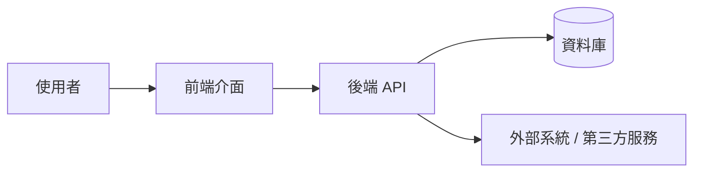
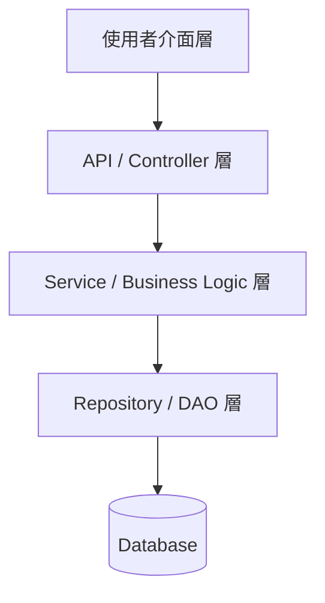
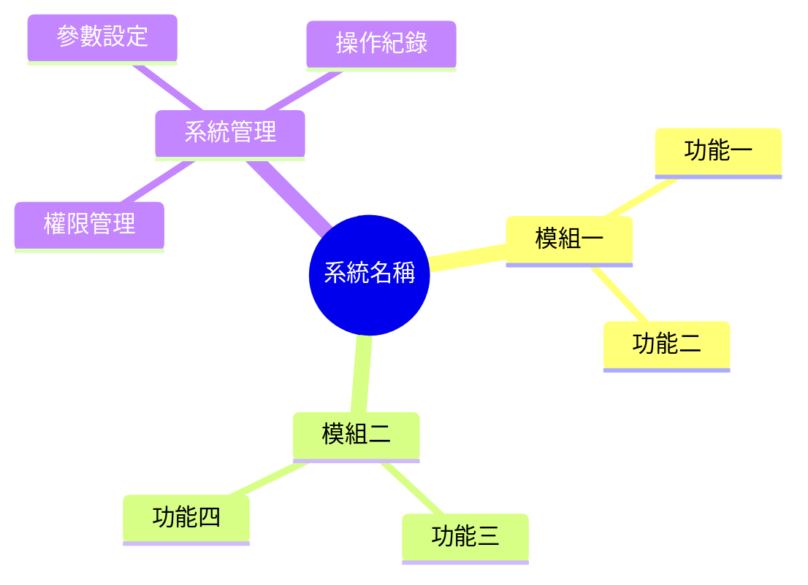
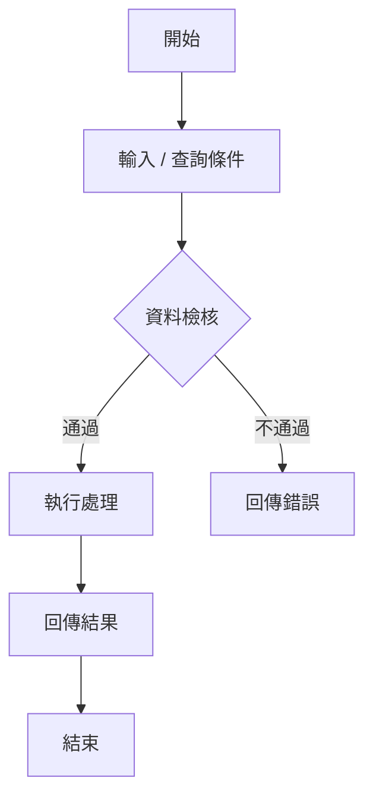
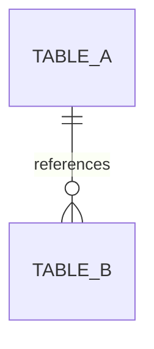
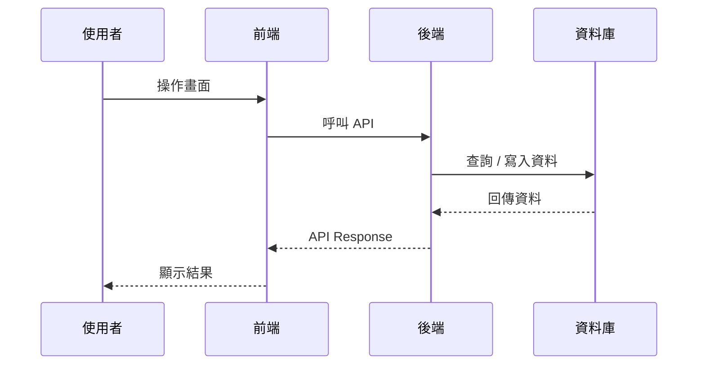

# 軟體設計規格書（SDD）範本

> 本範本供 AI 產出軟體設計規格書時使用。文件內容應使用繁體中文撰寫，並依實際系統、模組、API、資料庫與非功能需求調整。

## 封面

| 項目 | 內容 |
|------|------|
| 業主 / 單位 | `<業主或使用單位名稱>` |
| 專案名稱 | `<專案名稱>` |
| 系統名稱 | `<系統名稱>` |
| 文件名稱 | 軟體設計規格書 |
| 文件編碼 | `<文件代碼，例如 PROJECT-MODULE-SDD>` |
| 文件版本 | `<文件版本，例如 V1>` |
| 內部版本 | `<內部版本，例如 01.00>` |
| 撰寫單位 | `<撰寫單位>` |
| 撰寫日期 | `<YYYY/MM/DD>` |
| 作者 | `<作者或團隊>` |

## 文件資訊

| 項目 | 內容 |
|------|------|
| 文件目的 | 說明本文件用途、閱讀對象與後續開發、測試、維運依據。 |
| 適用範圍 | 說明本文件涵蓋的系統、模組、功能與不包含項目。 |
| 相關文件 | 列出需求規格書、系統架構文件、API 規格、資料庫設計文件、會議紀錄等。 |
| 名詞定義 | 列出本文件使用之專有名詞、縮寫與定義。 |

## 章節目錄

- [1. 概說](#1-概說)
- [2. 系統概述](#2-系統概述)
- [3. 系統設計](#3-系統設計)
- [4. 非功能需求設計](#4-非功能需求設計)
- [5. 修訂記錄](#5-修訂記錄)

## 圖目錄

| 圖號 | 圖名 | 章節 | 備註 |
|------|------|------|------|
| 圖2-1 | 系統架構圖 | 2.1 | `<待補>` |
| 圖3-1 | 模組設計架構圖 | 3.1 | `<待補>` |
| 圖3-2 | 功能架構圖 | 3.2 | `<待補>` |
| 圖3-N | `<功能 UI 示意圖>` | 3.3.N | `<待補>` |
| 圖3-N | `<資料流圖>` | 3.5.N | `<待補>` |

## 表目錄

| 表號 | 表名 | 章節 | 備註 |
|------|------|------|------|
| 表3-1 | 系統功能架構說明 | 3.2 | `<待補>` |
| 表3-N | `<功能欄位定義說明>` | 3.3.N | `<待補>` |
| 表3-N | `<功能欄位檢核說明>` | 3.3.N | `<待補>` |
| 表3-N | `<資料表欄位說明>` | 3.4.N | `<待補>` |
| 表3-N | 錯誤分類與回應策略說明 | 3.6 | `<待補>` |
| 表3-N | 錯誤碼設計說明 | 3.6 | `<待補>` |
| 表4-N | 角色與功能模組權限對照表 | 4.1 | `<待補>` |

---

# 1. 概說

## 1.1 識別

本文件為 `<承作單位>` 依據 `<專案名稱>` 之需求訪談、需求規格與設計規劃所訂定之「軟體設計規格書」。

| 項目 | 內容 |
|------|------|
| 專案編號 | `<專案編號>` |
| 系統編號 | `<系統編號>` |
| 系統名稱 | `<系統名稱>` |
| 文件代碼 | `<文件代碼>` |
| 文件版本 | `<文件版本>` |

## 1.2 專案名稱

本專案名稱為：`<專案名稱>`。

## 1.3 範圍

本文件說明 `<系統名稱>` 之系統設計與功能範圍，作為開發、測試、驗收與維運依據。

本系統設計範圍包含：

- `<功能模組一>`
- `<功能模組二>`
- `<功能模組三>`
- `<資料處理或批次模組>`
- `<系統管理或設定模組>`

本文件不包含：

- `<排除項目一>`
- `<排除項目二>`

## 1.4 依據

| 類別 | 文件 / 來源 | 說明 |
|------|-------------|------|
| 招標 / 契約 | `<文件名稱>` | `<說明>` |
| 需求文件 | `<SRS 文件名稱>` | `<說明>` |
| 會議紀錄 | `<會議紀錄名稱>` | `<說明>` |
| UI/UX 文件 | `<設計文件名稱>` | `<說明>` |
| API 規格 | `<API 文件名稱>` | `<說明>` |

## 1.5 相關之其它計畫書

- 專案管理計畫書
- 工作計畫書
- 使用者介面設計文件
- 測試計畫書
- 維運計畫書
- 資安或防護基準文件

## 1.6 參考資料

| 文件名稱 | 文件編號 / 版本 | 說明 |
|----------|------------------|------|
| `<參考資料一>` | `<編號>` | `<說明>` |
| `<參考資料二>` | `<編號>` | `<說明>` |

---

# 2. 系統概述

## 2.1 系統架構設計

說明本系統整體架構、主要元件、前後端分工、外部系統介接、資料交換方式與部署概念。



| 元件 | 說明 | 技術 / 協定 | 備註 |
|------|------|-------------|------|
| 前端 | `<前端功能與責任>` | `<React/Vue/HTML5 等>` | `<備註>` |
| 後端 | `<後端功能與責任>` | `<Rust/.NET/Java 等>` | `<備註>` |
| 資料庫 | `<資料儲存內容>` | `<PostgreSQL/MySQL/SQLite/MSSQL>` | `<備註>` |
| 外部系統 | `<介接系統>` | `<REST/TCP/File/API>` | `<備註>` |

## 2.2 系統環境架構設計

| 環境 | 說明 |
|------|------|
| 開發環境 | `<開發環境配置>` |
| 測試環境 | `<測試環境配置>` |
| 正式環境 | `<正式環境配置>` |
| 備援架構 | `<主備、HA、容器或叢集設計>` |
| 網路安全 | `<防火牆、TLS、網段限制>` |
| 日誌與監控 | `<集中式日誌、告警、監控工具>` |

## 2.3 系統功能模組概述

| 模組 | 功能概述 | 功能編號 | 使用角色 |
|------|----------|----------|----------|
| `<模組一>` | `<模組功能說明>` | `<編號>` | `<角色>` |
| `<模組二>` | `<模組功能說明>` | `<編號>` | `<角色>` |
| `<模組三>` | `<模組功能說明>` | `<編號>` | `<角色>` |

### 2.3.1 `<模組一名稱>`

`<描述此模組的業務目的、使用情境、主要輸入、處理與輸出。>`

### 2.3.2 `<模組二名稱>`

`<描述此模組的業務目的、使用情境、主要輸入、處理與輸出。>`

### 2.3.3 `<系統管理模組>`

`<描述設定、權限、稽核、參數管理等管理功能。>`

### 2.3.4 `<資料處理模組>`

`<描述批次、排程、統計、資料轉換、資料同步等處理。>`

---

# 3. 系統設計

## 3.1 模組設計

說明系統模組分層、模組間依賴、主要資料流與責任邊界。



| 模組 | 子模組 | 職責 | 輸入 | 輸出 |
|------|--------|------|------|------|
| `<模組>` | `<子模組>` | `<職責>` | `<輸入>` | `<輸出>` |

## 3.2 功能架構圖



### 表3-1：系統功能架構說明

| 功能項目 | 功能說明 | 功能編號 | 備註 |
|----------|----------|----------|------|
| `<功能項目>` | `<功能說明>` | `<功能編號>` | `<備註>` |

## 3.3 細部功能規格

> 每一項功能請依下列格式撰寫。若功能無 UI，請於「功能 UI」註明「無 UI」。

### 3.3.N `<功能名稱>` (`<功能編號>`)

#### 3.3.N.1 功能說明

`<描述功能目的、使用角色、業務規則、操作流程、輸入與輸出。>`

#### 3.3.N.2 功能 UI

| 項目 | 說明 |
|------|------|
| UI 圖號 | `<圖3-N>` |
| UI 名稱 | `<UI 示意圖名稱>` |
| 操作流程 | `<使用者操作流程>` |
| RWD / 行動裝置 | `<是否支援與呈現方式>` |

#### 3.3.N.3 欄位規格

| 欄位名稱 | 欄位類型 | 欄位屬性 | 對應資料庫欄位 | 說明 |
|----------|----------|----------|----------------|------|
| `<欄位>` | `<Text/Select/Radio/Checkbox/Button>` | `<Visible/Enable/Read-only/Required>` | `<Table.Column>` | `<說明>` |

#### 3.3.N.4 欄位檢核

| 欄位名稱 | 檢核方式 | 提示文字 | 錯誤碼 |
|----------|----------|----------|--------|
| `<欄位>` | `<必填/長度/格式/範圍/唯一性>` | `<提示文字>` | `<錯誤碼>` |

#### 3.3.N.5 功能流程



#### 3.3.N.6 API 設計

| 項目 | 內容 |
|------|------|
| API 名稱 | `<API 名稱>` |
| Method | `<GET/POST/PUT/PATCH/DELETE>` |
| URL | `<API URL>` |
| 權限 | `<所需角色或權限>` |
| Request Content-Type | `application/json` |
| Response Content-Type | `application/json` |

##### Request

```json
{
  "field": "value"
}
```

##### Response - 成功

```json
{
  "code": "0000",
  "message": "交易成功",
  "data": {}
}
```

##### Response - 失敗

```json
{
  "code": "E999",
  "message": "系統錯誤 / 非預期錯誤，請洽系統管理人員",
  "details": []
}
```

#### 3.3.N.7 後端處理邏輯

| 步驟 | 說明 | 主要模組 / 函式 | 備註 |
|------|------|------------------|------|
| 1 | `<接收請求>` | `<Controller/Handler>` | `<備註>` |
| 2 | `<資料驗證>` | `<Validator>` | `<備註>` |
| 3 | `<商業邏輯>` | `<Service>` | `<備註>` |
| 4 | `<資料存取>` | `<Repository/ORM>` | `<備註>` |
| 5 | `<回傳結果>` | `<Response Builder>` | `<備註>` |

#### 3.3.N.8 日誌設計

| 時機 | Log Level | 記錄內容 | 敏感資料處理 |
|------|-----------|----------|--------------|
| API 開始 | DEBUG | method、url、request id | 遮罩 token/password |
| 參數驗證 | DEBUG | 欄位名稱、檢核結果 | 不記錄敏感值 |
| 資料存取 | DEBUG | table、query 條件摘要 | 不記錄完整 SQL 密碼 |
| API 結束 | DEBUG | status、耗時、response 摘要 | 遮罩敏感欄位 |
| 例外錯誤 | ERROR | error code、stack trace | 遮罩敏感資料 |

## 3.4 資料庫設計

### 3.4.N `<資料表中文名稱>` (`<TableName>`)

| 欄位名稱 | 資料類型 | 允許 Null | Key | 預設值 | 說明 |
|----------|----------|-----------|-----|--------|------|
| `<Column>` | `<Type>` | `<YES/NO>` | `<PK/FK/UK>` | `<Default>` | `<說明>` |

#### Index / Constraint

| 名稱 | 類型 | 欄位 | 說明 |
|------|------|------|------|
| `<IndexName>` | `<PK/UK/INDEX/FK>` | `<欄位>` | `<說明>` |

#### 資料表關聯



## 3.5 資料流設計

### 3.5.N `<功能 / 模組資料流>`



| 步驟 | 來源 | 目的 | 資料內容 | 備註 |
|------|------|------|----------|------|
| 1 | `<來源>` | `<目的>` | `<資料內容>` | `<備註>` |

## 3.6 錯誤處理與例外處理

### 3.6.1 錯誤捕捉與分類

| 異常類型 | 描述 | 回應處理方式 |
|----------|------|--------------|
| 使用者輸入異常 | 使用者輸入資料不符合規則。 | 回傳欄位檢核錯誤並提示使用者。 |
| 執行期錯誤 | 程式錯誤或非預期情況。 | 記錄 error log，回傳通用錯誤訊息。 |
| 系統資源錯誤 | 資源不足或服務不可用。 | 記錄 error log，必要時通知管理員。 |
| 外部依賴錯誤 | 第三方 API 或外部系統異常。 | 記錄錯誤，啟動重試或回傳外部依賴錯誤。 |

### 3.6.2 錯誤碼設計

| 處理結果 | 代碼 | HTTP Status Code | 處理結果說明 | 原因說明 |
|----------|------|------------------|--------------|----------|
| 成功 | `0000` | `200` | 交易成功 | - |
| 新增成功 | `0000` | `201` | 新增成功 | - |
| 資料已存在 | `E001` | `400` | 資料已經存在 | 唯一值重複 |
| 資料不存在 | `E002` | `404` | 資料不存在 | 查詢 / 更新 / 刪除資料不存在 |
| 欄位檢核錯誤 | `EV01` | `400` | 欄位不得為空 | 必填欄位未填 |
| 欄位長度錯誤 | `EV02` | `422` | 欄位長度超過限制 | 長度檢核失敗 |
| 未驗證 | `EA01` | `401` | 未進行驗證 | Token / APID 缺失 |
| 無權限 | `EA02` | `403` | 無權限操作 | 權限不足 |
| 外部 API 失敗 | `E998` | `500` | 外部 API 呼叫失敗 | 外部依賴異常 |
| 系統錯誤 | `E999` | `500` | 系統錯誤 / 非預期錯誤 | 未預期例外 |

### 3.6.3 錯誤日誌

錯誤日誌需包含：

- 時間戳
- Request ID / Trace ID
- 使用者 / 角色 / IP
- API Method / URL
- 異常類型
- 錯誤訊息
- 堆疊追蹤
- 日誌分級
- 敏感資料遮罩結果

---

# 4. 非功能需求設計

## 4.1 安全性需求

### 4.1.1 使用權限需求

| 角色 | 權限說明 | 可操作模組 |
|------|----------|------------|
| 系統管理者 | `<所有系統管理權限>` | `<模組清單>` |
| 應用服務管理者 | `<管理與設定權限>` | `<模組清單>` |
| 應用服務操作者 | `<查詢與操作權限>` | `<模組清單>` |

### 4.1.2 資料安全需求

- 所有 API 應進行身分驗證與授權檢查。
- 機敏資料不可明文記錄於 log。
- 密碼、Token、API Key 應加密或雜湊保存。
- 資料庫連線需限制來源網段與權限。
- 應符合 OWASP API Security Top 10 與 OWASP Web Top 10 防護原則。

### 4.1.3 資料傳輸安全

- API 傳輸應使用 HTTPS / TLS 1.2 以上，建議 TLS 1.3。
- 禁止使用弱加密協定與不安全 Cipher Suite。
- 外部系統介接需具備身分驗證與傳輸加密。

### 4.1.4 資料儲存安全

- 機敏欄位應加密、遮罩或雜湊。
- 資料庫帳號應採最小權限原則。
- 定期備份與備份還原驗證。

## 4.2 日誌需求

| 類型 | 記錄內容 | 保存方式 | 保存期限 |
|------|----------|----------|----------|
| 操作日誌 | 使用者、功能、動作、時間、IP、結果 | `<集中式日誌 / DB>` | `<期限>` |
| 系統日誌 | 啟動、停止、設定、排程 | `<方式>` | `<期限>` |
| 錯誤日誌 | 例外、堆疊、錯誤碼 | `<方式>` | `<期限>` |
| 稽核日誌 | 權限變更、資料異動 | `<方式>` | `<期限>` |

日誌分級：

- `DEBUG`：開發與除錯訊息。
- `INFO`：一般執行狀態。
- `WARN`：可恢復或需注意事件。
- `ERROR`：執行錯誤或需管理者介入事件。

## 4.3 效能需求

| 項目 | 需求 |
|------|------|
| 頁面載入時間 | `<例如：主要頁面 5 秒內完成>` |
| API 回應時間 | `<例如：95% API 於 5 秒內完成>` |
| 併發使用者 | `<例如：100 concurrent users>` |
| 長時間穩定性 | `<例如：連續運行一週>` |
| 壓力測試工具 | `<例如：JMeter/k6>` |
| 監控指標 | CPU、記憶體、磁碟、I/O、網路、DB connection pool |

## 4.4 介面需求

### 4.4.1 使用者操作介面需求

- 支援 `<瀏覽器清單>`。
- 支援 HTML5 與現代瀏覽器。
- 使用者介面需具備一致性、可讀性與錯誤提示。
- 重要操作需提供確認機制。

### 4.4.2 使用者操作介面顯示需求

- 支援響應式網頁設計（RWD）。
- 手機版需依資訊重要性由上至下排列。
- 重要按鈕需易於點選。
- 操作後應提供視覺回饋。

### 4.4.3 軟體介面需求

| 介面類型 | 說明 |
|----------|------|
| API 架構 | RESTful / GraphQL / WebSocket / Socket.IO |
| 傳輸格式 | JSON |
| 傳輸協定 | HTTPS / TCP / WebSocket |
| 身分驗證 | JWT / OAuth / API Key |
| 資料庫介面 | ORM / SQL / Migration |
| 外部系統 | `<外部系統名稱與協定>` |

---

# 5. 修訂記錄

| 版本 | 內部版本 | 日期 | 章節 | 修訂描述 | 撰寫人員 | 審查人員 |
|------|----------|------|------|----------|----------|----------|
| V1 | 01.00 | `<YYYY/MM/DD>` | All | 初始文件 | `<姓名>` | `<姓名>` |
| V2 | 02.00 | `<YYYY/MM/DD>` | `<章節>` | `<修訂描述>` | `<姓名>` | `<姓名>` |

---

# 附錄 A：AI 產出檢查清單

AI 產出 SDD 時，應確認下列項目：

- [ ] 文件資訊完整：專案、系統、版本、日期、作者。
- [ ] 章節目錄、圖目錄、表目錄與本文一致。
- [ ] 系統架構圖與功能架構圖已描述清楚。
- [ ] 每個功能皆包含功能說明、UI、欄位規格、欄位檢核、API、後端流程與日誌設計。
- [ ] 資料庫設計包含欄位、型別、Null、Key、預設值與說明。
- [ ] 資料流設計包含來源、目的、資料內容與處理步驟。
- [ ] 錯誤碼與 HTTP Status Code 有一致規範。
- [ ] 安全性需求包含權限、傳輸、儲存、日誌遮罩與 OWASP 風險。
- [ ] 效能需求可量測，包含回應時間、併發數與測試工具。
- [ ] 修訂記錄已更新。

# 附錄 B：AI 產出提示詞建議

```text
請依據 89.sdd-template.md 產出軟體設計規格書，使用繁體中文。
請保留章節編號、表格格式、API request/response JSON、資料庫欄位表、錯誤碼表與修訂記錄。
若資訊不足，請以 <待補> 標示，不可自行捏造外部系統、欄位或權限。
所有敏感資料（密碼、Token、API Key）請以 *** 遮罩。
```
